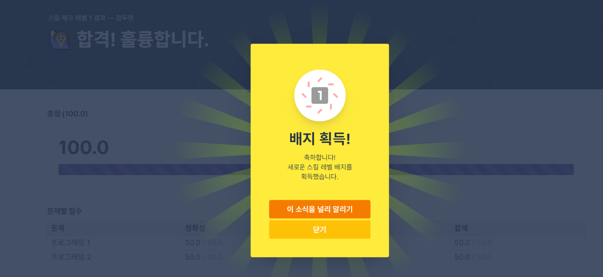
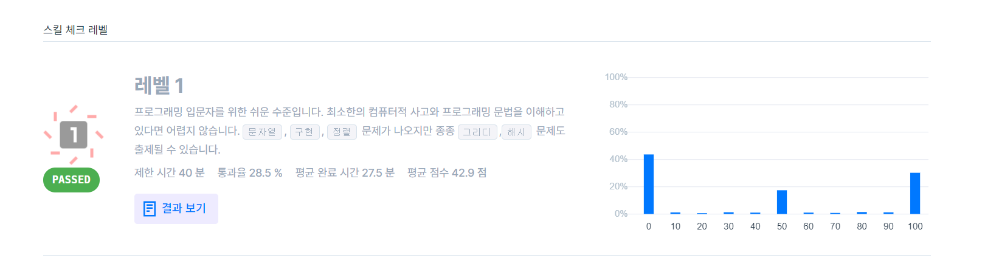

# Homework #1

### 1. Screen Shot

 

### 2. Source Files

테스트 레벨 1의 두 문제 모두 한 파일에 메서드 명을 각각 `solution_1`, `solution_2`로 설정해 풀이했습니다.

- [solution.py](src/solution.py)
- [solution_test.py](src/solution_test.py)
