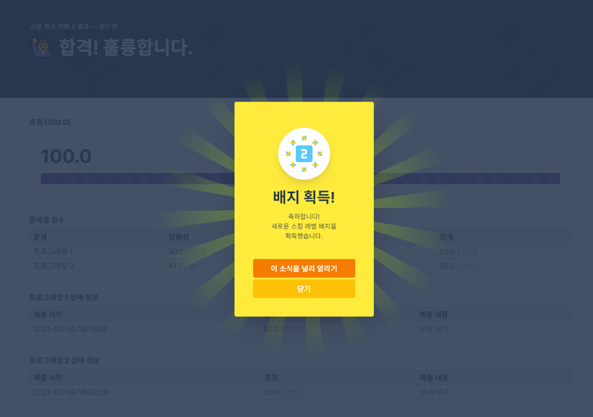

# Homework #6

프로그래머스 '레벨 2' 획득

## Screen Capture




## Source Code

[solution 1](src/test_1.py)
[solution 2](src/test_2.py)

### Problem #1

```python
def solution(arr):
    answer = max(arr)
    found = False

    while not found:
        for n in arr:
            if answer % n:
                break
        else:
            break

        answer += 1

    return answer
```

### Problem #2

```python
def solution(phone_book):
    answer = True
    phone_set = set(phone_book)

    for number in phone_set:
        tmp = ''

        for n in number:
            tmp += n
            if tmp != number and tmp in phone_set:
                return False

    return True
```
